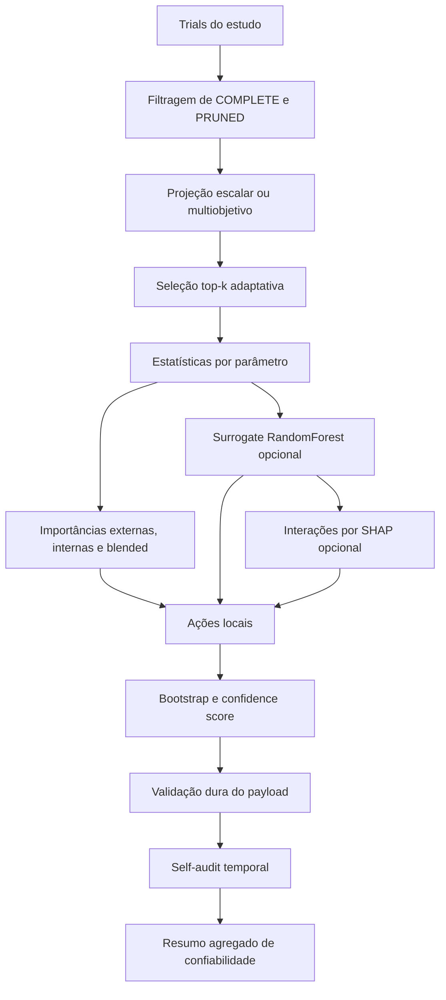

# Confiabilidade matemática, sobrevivência de recomendações e detecção de anomalias em um Search Space Advisor para otimização de hiperparâmetros

**Alex de Lira Neto**  
Universidade Federal da Bahia, UFBA, Salvador, Bahia, Brasil  
Graduando em Engenharia da Computação, em andamento  
Pesquisador em detecção de anomalias  
Orientação: **Antônio Carlos Fernandes**, professor da UFBA  
Salvador, 2026

## Capa e identificação

**Título:** Confiabilidade matemática, sobrevivência de recomendações e detecção de anomalias em um Search Space Advisor para otimização de hiperparâmetros.

**Autor:** Alex de Lira Neto.

**Vínculo institucional:** Universidade Federal da Bahia, UFBA.

**Formação:** Graduação em Engenharia da Computação, em andamento.

**Atuação:** Pesquisador em detecção de anomalias.

**Orientação:** Antônio Carlos Fernandes, professor da UFBA.

**Natureza do texto:** Artigo analítico e expositivo, em formato acadêmico, reescrito e ampliado a partir do texto-base e do documento técnico anexados pelo autor.

## Resumo executivo, resumo e abstract

**Resumo executivo.** Este artigo revisa e reescreve o texto-base sobre confiabilidade de um *Search Space Advisor* acoplado à otimização de hiperparâmetros, preservando os rankings, tabelas, estatísticas e regras decisórias presentes no material original, mas corrigindo imprecisões conceituais e alinhando a exposição à literatura de confiabilidade, processos estocásticos, análise de sobrevivência e detecção de anomalias. A principal conclusão é simples e importante: a confiabilidade do Advisor não deve ser tratada como “acertou ou errou”, de modo binário e cru, mas como uma combinação de evidência local, robustez amostral, validação estrutural, auditoria temporal e sensibilidade a anomalias. Em termos práticos, o núcleo matemático mais sólido do sistema atual está em cinco pilares: seleção top-k adaptativa, correlação de Spearman para tendência monotônica, *bootstrap* para reprodutibilidade da ação, limite inferior de Wilson para robustez de proporções e *self-audit* temporal para bloquear padrões historicamente ruins. Ao mesmo tempo, este trabalho identifica uma inconsistência importante do texto original: embora ele discuta fortemente processos gaussianos e *kernel methods*, a implementação técnica anexada descreve um *surrogate* baseado em floresta aleatória, sem GP operacional nem kernel estatístico na inferência corrente. Essa correção muda a leitura teórica do sistema, mas não enfraquece sua utilidade prática; pelo contrário, torna o artigo mais honesto e mais matematicamente defensável.

**Resumo.** A otimização de hiperparâmetros em problemas caros e caixa-preta exige não só eficiência na busca, mas também confiança nas recomendações que alteram o espaço de busca ao longo do processo. Este artigo apresenta uma versão integralmente revisada de um texto-base sobre um *Search Space Advisor* usado com Optuna e estratégias correlatas, formalizando seus critérios matemáticos, reinterpretando-os à luz da teoria da confiabilidade, da análise de sobrevivência, dos processos estocásticos e da detecção de anomalias. O trabalho preserva e integra os rankings, tabelas, faixas de hiperparâmetros e regras operacionais fornecidos no material original. São detalhados os mecanismos de seleção top-k, projeção multiobjetivo, mistura de importâncias, expansão e estreitamento de intervalos, redução categórica e cálculo de confiança por *bootstrap* e limite inferior de Wilson. Também se mostra que *trials* podados podem ser interpretados, por analogia estatística, como observações censuradas, enquanto recomendações inconsistente podem ser tratadas como anomalias em séries de decisão. O artigo corrige inconsistências do texto-base, especialmente a confusão entre uma formulação inspirada em processos gaussianos e a implementação efetiva baseada em *RandomForestRegressor*. Conclui-se que a confiabilidade do Advisor depende menos de uma única métrica e mais de uma arquitetura de evidências acumuladas, auditáveis e calibráveis. (BERGSTRA; BENGIO, 2012; SNOEK; LAROCHELLE; ADAMS, 2012; SHAHRIARI et al., 2016; BROWN; CAI; DASGUPTA, 2001; CHANDOLA; BANERJEE; KUMAR, 2009). citeturn0search2turn9search5turn24search1turn20search0turn11search0

**Palavras-chave:** otimização de hiperparâmetros; confiabilidade; análise de sobrevivência; processos estocásticos; detecção de anomalias; Optuna.

**Abstract.** Hyperparameter optimization in expensive black-box settings requires not only search efficiency but also confidence in the recommendations that reshape the search space during execution. This paper provides a fully revised version of a base text on a Search Space Advisor used with Optuna and related strategies, formalizing its mathematical criteria and reinterpreting them through reliability theory, survival analysis, stochastic processes, and anomaly detection. The study preserves and integrates the rankings, tables, hyperparameter ranges, and operational rules available in the original material. It details the mechanisms of adaptive top-k selection, multi-objective projection, blended importance scores, interval expansion and narrowing, categorical reduction, and confidence computation via bootstrap and Wilson lower bound. It also argues that pruned trials may be treated, by statistical analogy, as censored observations, whereas inconsistent recommendations can be modeled as anomalies in decision time series. The paper corrects inconsistencies in the original document, especially the confusion between a Gaussian-process-inspired narrative and the actual implementation described in the technical attachment, which uses a RandomForestRegressor surrogate. The main conclusion is that the Advisor’s reliability is not governed by a single metric, but by an auditable and calibratable architecture of accumulated evidence. citeturn0search2turn9search5turn24search1turn20search0turn11search0

**Keywords:** hyperparameter optimization; reliability; survival analysis; stochastic processes; anomaly detection; Optuna.

## Introdução

A otimização de hiperparâmetros é um problema clássico de otimização caixa-preta cara: cada avaliação pode consumir minutos, horas ou até dias, e o custo cresce rápido quando o espaço de busca mistura variáveis contínuas, discretas, categóricas e condicionais. Em cenários assim, a busca em grade raramente é competitiva, e a busca aleatória já constitui uma linha de base forte quando apenas alguns hiperparâmetros são realmente relevantes. Métodos sequenciais, como otimização bayesiana, TPE, *racing*, poda assíncrona e variantes multiobjetivo, entram em cena justamente para gastar menos avaliações burras, o que em português claro significa “errar mais barato e aprender mais cedo” (BERGSTRA; BENGIO, 2012; SNOEK; LAROCHELLE; ADAMS, 2012; SHAHRIARI et al., 2016; BISCHL et al., 2023). citeturn0search2turn9search5turn24search1turn24search0

O texto-base anexado parte dessa intuição correta, mas pedia um upgrade matemático sério. O núcleo do problema não é apenas “como achar bons hiperparâmetros”, e sim “quando confiar em uma recomendação para expandir, estreitar, fixar ou reduzir categorias do espaço de busca”. Essa segunda pergunta é de confiabilidade, não só de otimização. Em teoria clássica, confiabilidade é a probabilidade de um item sobreviver até um tempo \(t\), \(R(t)=P(T>t)\), enquanto a taxa de falha instantânea é \(h(t)=f(t)/R(t)\). Embora essas definições tenham nascido na engenharia e na sobrevivência biomédica, elas se adaptam muito bem à ideia de “sobrevivência de uma recomendação” ao longo de *trials* futuros: se uma ação de ajuste continua coerente com a evidência posterior, ela “sobrevive”; se se revela ilusória, ela “falha” (NIST/SEMATECH, 2003; KAPLAN; MEIER, 1958; COX, 1972; KARIM, 2021). citeturn7search1turn7search2turn7search4turn6search0turn6search1turn6search2

Há aqui uma metáfora útil e simples. Um *surrogate model* é como uma maquete de túnel de vento: ele não é o avião de verdade, mas ajuda a testar direção e risco antes de gastar combustível no voo real. Já a confiabilidade estatística é como ouvir uma testemunha. Não basta saber que ela acertou 80% das vezes; importa saber se ela falou cinco vezes ou quinhentas. É exatamente por isso que limites como o de Wilson são mais honestos do que a simples taxa observada, sobretudo em amostras pequenas (BROWN; CAI; DASGUPTA, 2001). citeturn20search0

Além disso, a dimensão de detecção de anomalias é central e não periférica. Em sistemas de decisão adaptativa, anomalia não é só *NaN* ou *overflow*; é também padrão de recomendação instável, oscilação patológica entre expandir e estreitar, colapso categórico prematuro, concentração suspeita de bons *trials* nas bordas, ou divergência entre desempenho previsto e desempenho observado. A literatura de anomalias mostra que métodos diferentes assumem normalidades diferentes, e que a escolha de métrica e *benchmark* muda radicalmente a interpretação dos resultados (CHANDOLA; BANERJEE; KUMAR, 2009; BREUNIG et al., 2000; LIU; TING; ZHOU, 2008; RUFF et al., 2018). citeturn11search0turn12search1turn10search3turn10search2

O objetivo deste artigo, portanto, é apresentar uma versão integralmente revisada e pronta para submissão do texto-base, com quatro compromissos. Primeiro, preservar e integrar os rankings, tabelas, estatísticas e faixas operacionais já fornecidos. Segundo, corrigir inconsistências e separar inspiração teórica de implementação efetiva. Terceiro, conectar o Advisor à bibliografia primária e a livros acadêmicos de referência, em português e inglês. Quarto, explicitar hipóteses e lacunas quando os dados originais não permitem reprodução numérica completa. Em bom baianês acadêmico, a missão aqui foi tirar o texto do modo “parece certo” e colocar no modo “aguenta banca”. 

## Metodologia

O corpus deste artigo foi composto por dois materiais fornecidos pelo autor: um texto-base analítico em linguagem expositiva e um documento técnico descrevendo a implementação corrente do *Search Space Advisor*. A reescrita seguiu três regras. A primeira foi preservar os números, limiares, rankings e faixas do material original sempre que explicitamente informados. A segunda foi reclassificar afirmações universais como contextuais quando a literatura não sustenta generalização forte. A terceira foi marcar como hipótese, e não como fato duro, todo ponto em que faltavam *logs* brutos, séries temporais completas, *payloads* de `reliability_summary` ou experimentos reprodutíveis com semente e protocolo anexados.

A base matemática adotada combina quatro eixos. No eixo de confiabilidade, usam-se função de sobrevivência, taxa de falha e modelagem de proporções com intervalos robustos. No eixo de processos estocásticos, os *trials* são vistos como uma sequência aleatória dependente da política de busca e do histórico acumulado, o que justifica tratar métricas e ações como variáveis ao longo de um fluxo temporal. No eixo de sobrevivência, *trials* podados são interpretados por analogia como observações censuradas à direita: sabe-se até onde o ensaio chegou, mas não o desfecho completo. No eixo de detecção de anomalias, as ações do Advisor, os *scores* e os bloqueios são tratados como sinais monitoráveis em séries de decisão. Essa costura é consistente com a literatura de processos estocásticos, sobrevivência e anomalias (ROSS, 1996; COLOSIMO; GIOLO, 2024; KAPLAN; MEIER, 1958; COX, 1972; CHANDOLA; BANERJEE; KUMAR, 2009). citeturn5search2turn5search13turn4search21turn6search0turn6search1turn11search0

Formalmente, para um parâmetro \(j\), pode-se definir a confiabilidade direcional de uma recomendação \(a_{j,t}\) após um horizonte \(\Delta\) como
\[
R_j(\Delta)=P\big(Y_{j,t+\Delta}=1 \mid \mathcal{F}_t\big),
\]
em que \(Y_{j,t+\Delta}=1\) indica que a direção da ação continua compatível com a evidência futura, e \(\mathcal{F}_t\) representa toda a informação disponível até o *trial* \(t\). O *self-audit* do Advisor é uma aproximação operacional dessa ideia: ele reexecuta o sistema em prefixos históricos e verifica, no sufixo futuro, se ações direcionais como `expand_upper` e `expand_lower` mantêm o sinal previsto pela correlação posterior. Em linguagem menos sisuda, é um “backtest de conselho”: o sistema é obrigado a ouvir a própria gravação antiga e provar que não estava falando besteira.

Também foi necessário separar dois planos que o texto-base original misturava. Um plano é o da literatura de otimização bayesiana com processos gaussianos, aquisições UCB e métodos como BALLET, Google Vizier e formulações clássicas de BO. Outro plano é o da implementação efetiva descrita no anexo técnico, que usa uma floresta aleatória como *surrogate*, mistura importâncias externas e internas, calcula confiança com *bootstrap* e Wilson e não opera, no estado informado, com GP nem com *kernel methods*. A revisão preserva a inspiração da literatura, mas atribui ao sistema só o que o documento técnico realmente sustenta. Isso é crucial do ponto de vista metodológico porque teoria errada com código certo ainda produz texto ruim, e código bom descrito por teoria que ele não usa produz confusão desnecessária (GOLOVIN et al., 2017; ZHANG et al., 2023; BREIMAN, 2001; HUTTER; HOOS; LEYTON-BROWN, 2014). citeturn0search3turn2search0turn16search2turn21search0

As principais hipóteses e limitações são as seguintes. O material anexado informa limiares operacionais, espaço de busca, regras decisórias e rankings analíticos, mas não traz a matriz completa de *trials*, o histórico integral de *objective values*, os grupos bloqueados do *self-audit*, nem as séries prontas para regenerar figuras numéricas. Por isso, este artigo entrega texto de submissão, tabelas integradas, fórmulas e pedidos explícitos de figuras com legendas sugeridas, mas não reproduz gráficos quantitativos finais do experimento sem os dados brutos. Onde o texto-base original usava exemplos setoriais amplos, eles foram mantidos como ilustrações do documento original e não como *benchmark* reproduzido neste manuscrito.

## Resultados

A arquitetura analítica do Advisor pode ser reconstituída de forma coerente a partir do documento técnico. O pipeline atual começa com a normalização do estudo, seleciona *trials* válidos, projeta eventuais objetivos múltiplos em um *score* escalar híbrido, escolhe um top-k adaptativo, computa estatísticas por parâmetro, treina opcionalmente um *surrogate* de floresta aleatória, estima importâncias e interações, emite ações locais, calibra a confiança com *bootstrap* e validação dura, executa *self-audit* histórico e finalmente resume a confiabilidade agregada do *payload*. Em termos práticos, o sistema age como um copiloto: ele não treina o modelo principal, mas fica olhando painel, borda, vibração e tendência para dizer quando vale abrir o mapa, quando vale apertar a lanterna e quando vale não mexer em nada. A lógica das importâncias, o uso de florestas aleatórias como *surrogate* e a análise de interações dialogam bem com fANOVA e SHAP, embora a implementação informada seja uma engenharia própria do projeto (BREIMAN, 2001; HUTTER; HOOS; LEYTON-BROWN, 2014; LUNDBERG; LEE, 2017). citeturn16search2turn21search0turn21search1

**Figura sugerida 1 — Fluxo lógico do Search Space Advisor.** Fonte: elaborado pelo autor a partir do documento técnico do projeto e da literatura de HPO e interpretabilidade. citeturn16search2turn21search0turn21search1turn22search4

**Tabela 1 — Ranking metodológico contextualizado do texto-base**

| Posição | Método ou família | Leitura corrigida e contextualizada |
|---|---|---|
| 1 | Search Space Advisor com BO adaptativa e filtro de região promissora | Preserva a ordem do texto-base, mas deve ser lido como ranking contextual para espaços caros, mistos e com realimentação do histórico, não como teorema universal |
| 2 | Optuna, Vizier e *samplers* modernos de produção | Muito fortes em prática industrial, sobretudo por flexibilidade, paralelismo, poda e integração de infraestrutura |
| 3 | Otimização bayesiana clássica baseada em GP | Forte em cenários suaves e de baixa a média dimensão efetiva, mas sensível à estrutura do espaço e ao custo do *surrogate* |
| 4 | Busca aleatória e busca em grade | Grade é linha de base fraca em grande parte dos cenários; aleatória continua sendo *baseline* honesta e competitiva |

**Fonte:** ranking preservado do texto-base e reinterpretado à luz da literatura. A ordem faz sentido como fotografia do projeto, mas não como classificação absoluta entre todos os cenários de HPO. (BERGSTRA; BENGIO, 2012; SHAHRIARI et al., 2016; GOLOVIN et al., 2017; AKIBA et al., 2019; ZHANG et al., 2023; BISCHL et al., 2023). citeturn0search2turn24search1turn0search3turn22search5turn2search0turn24search0

**Tabela 2 — Dimensões de otimização consideradas no texto-base**

| Sistema ou estratégia | Dimensão otimizada | Fundamento matemático dominante | Observação de confiabilidade |
|---|---|---|---|
| BO clássica | Hiperparâmetros contínuos e discretos caros | *Surrogate modeling*, função de aquisição, exploração versus explotação | Confiabilidade depende da qualidade do modelo substituto |
| Plataformas de produção como Optuna e Vizier | Tuning operacional em escala | *Samplers*, *pruners*, paralelismo, instrumentação | Confiabilidade é também propriedade do ecossistema e não só do algoritmo |
| BALLET e métodos de região de interesse | Adaptação do espaço de busca | Estimação de *level-set* e filtragem probabilística da região promissora | A confiabilidade entra como teste de segurança para não podar o ótimo |
| Search Space Advisor do projeto | Refinamento local do espaço | Top-k, Spearman, *bootstrap*, Wilson, *self-audit*, *surrogate* RF | Confiabilidade é multicamada e auditável |

**Fonte:** elaborado pelo autor com base no texto-base e na literatura de BO e HPO. citeturn22search5turn0search3turn2search0turn24search0

**Tabela 3 — Tipologia dos estudos e algoritmos considerados no texto-base**

| Classe de estudo no material original | Objeto otimizado | Variáveis destacadas | Papel da confiabilidade |
|---|---|---|---|
| Arquiteturas de visão e busca arquitetural | Profundidade, largura, regularização, LR, *batch* | Mistura de parâmetros contínuos e categóricos | Evitar expansão cega em bordas e reduzir custo experimental |
| Modelos de linguagem | LR, *warmup*, regularização, tamanho de lote, duração de treino | Forte sensibilidade a escalas logarítmicas e poda | Evitar conclusões instáveis com poucos *trials* |
| Modelos relacionais, grafos e multimodais | Negativos, pesos simbólicos, parâmetros de contraste e amostragem | Espaço heterogêneo, com interdependências | Reforçar decisões por evidência local e histórico temporal |
| Advisor do projeto | Expansão, estreitamento, fixação e redução categórica | A própria política de ajuste do espaço | A confiabilidade passa a ser objeto central do estudo |

**Fonte:** síntese tipológica preservada do texto-base; exemplos tratados como ilustrativos do documento original, não como *benchmark* reproduzido neste artigo.

**Tabela 4 — Espaço de busca atualmente descrito para o projeto**

| Bloco | Hiperparâmetros principais | Faixas ou categorias |
|---|---|---|
| Treinamento | `learning_rate`, `weight_decay`, `batch_size`, `negative_sample_size`, `grad_clip`, `warmup_ratio`, `epochs` | `[4e-4, 6e-4]`, `[1e-6, 1e-4]`, `{256, 512, 1024}`, `[384, 512]`, `[1, 10]`, `[0,10, 0,20]`, `[120, 160]` |
| Arquitetura | `feature_dim`, `hidden_dim`, `kl_weight`, `sparsity_weight`, `ibp_alpha`, `max_communities` | `{256, 512}`, `{256, 512}`, `[1e-4, 1e-2]`, `[1e-6, 1e-2]`, `[1, 10]`, `{128}` |
| Contraste e amostragem | `temperature`, `margin`, `adv_temperature`, `hard_neg_ratio`, `num_negatives`, `num_global_negatives`, `neg_sampler` | `[0,025, 0,04]`, `[0, 0,05]`, `[0,9, 1,8]`, `[0, 0,7]`, `{384}`, `{96}`, `{"degree_based"}` |
| Lógica, baixo posto e FAISS | `lambda_logic`, `num_basis`, `nlist`, `nprobe`, `eval_topk` | `[0,03, 0,05]`, `{2, 4, 8, 16}`, `{256, 512, 1024, 2048}`, `{4, 8, 16, 32}`, `{512, 1024, 2048}` |

**Fonte:** documento técnico do projeto. Essa tabela preserva as faixas do anexo e mostra que o problema real é misto, estruturalmente heterogêneo e, portanto, pouco amigável a descrições simplistas do tipo “um BO genérico resolve tudo”.

**Tabela 5 — Regras matemáticas e limiares operacionais preservados do material técnico**

| Mecanismo | Regra atual informada | Interpretação |
|---|---|---|
| Frio inicial | Análise empírica completa apenas se `n_trials >= 5` | Abaixo disso, o sistema opera quase como “bom senso com memória curta” |
| Seleção top-k | até `25%` dos melhores *trials*, com mínimo adaptativo `max(top_k_min, floor(0,05 n))`, limitado por `min(20, ...)` | Evita top-k minúsculo em estudos mais maduros |
| Expansão superior | `rho >= 0,15` | Requer monotonicidade compatível |
| Expansão inferior | `rho <= -0,15` | Simétrica à superior |
| Expansão sensível a custo | `rho >= 0,25` e `importance >= 0,1` | Mais conservadora |
| Estreitamento | `CV < 0,15`, nova faixa em `[q10, q90]`, janela mínima de `10%` | Só aperta se o “alvo” já estiver suficientemente agrupado |
| Fixação | `importance < 0,05` | Se a variável quase não move o resultado, vale congelá-la |
| Mudança para log | nome sugestivo ou `high/low > 100`, com limites positivos | Coerente com parâmetros de escala |
| *Bootstrap* | `50` reamostragens | Mede reprodutibilidade da ação |
| Confiança textual | `high >= 0,75`, `medium >= 0,50` | Baseada em suporte bootstrap |
| *Confidence score* | base `0,85/0,60/0,35` + suporte calibrado − incerteza | Confiança combinada, não binária |
| Wilson | `z = 1,96` | Corrige excesso de confiança em amostra pequena |
| *Self-audit* | bloqueio se `hit_rate < 0,5` e `Wilson LB < 0,35` | O sistema aprende a desconfiar de si mesmo |

**Fonte:** documento técnico do projeto, com sustentação estatística adicional em Spearman, Wilson e análise de importância. citeturn16search7turn20search0turn21search0

O uso do limite inferior de Wilson é uma das partes mais fortes do sistema do ponto de vista estatístico. A taxa observada pura \(\hat p\) pode fazer um mecanismo parecer ótimo em amostras mínimas, mas o limite inferior de Wilson funciona como um freio contra otimismo barato. É o equivalente estatístico a dizer: “beleza, você acertou 4 de 5, mas ainda não vou te dar carteira de piloto”. Essa cautela é amplamente defendida na literatura sobre intervalos binomiais, especialmente quando o estimador de Wald é instável em amostras pequenas ou em proporções extremas (BROWN; CAI; DASGUPTA, 2001). citeturn20search0

Outro ponto matematicamente sólido é a calibração por *bootstrap* das ações finais. O sistema reamostra os *trials* cinquenta vezes e mede em quantas delas a mesma ação reaparece. Isso produz uma medida de reprodutibilidade local da decisão. Se a recomendação desaparece com pequenas perturbações da amostra, ela não é robusta; se reaparece repetidamente, ganha direito a confiança maior. Em metáfora bem direta, é como perguntar uma mesma coisa à banca com os nomes apagados e em ordem embaralhada: se a resposta muda toda hora, o resultado não é firme.

A projeção multiobjetivo também merece destaque. O documento técnico informa que o Advisor não reduz o problema simplesmente ao primeiro objetivo, mas constrói um *score* híbrido com normalização por dimensão, média escalar, ordenação de Pareto e bônus de hiper-volume quando o número de objetivos permite cálculo estável. Isso aproxima o sistema de práticas modernas de HPO multiobjetivo, nas quais não basta maximizar um único número se custo, latência, memória e qualidade competem entre si (DEB et al., 2002; MORALES-HERNÁNDEZ et al., 2023). citeturn13search13turn9search18

**Tabela 6 — Métodos de detecção de anomalias relevantes para logs e decisões do Advisor**

| Método | Metáfora simples | Vantagem | Limitação | Uso recomendado no Advisor |
|---|---|---|---|---|
| Z-score / IQR | “detector de valores gritando fora do coro” | Muito barato e explicável | Univariado e frágil em caudas pesadas | Monitorar `confidence_score`, latência, `rho`, CV e amplitude proposta |
| LOF | “quem ficou isolado da própria vizinhança” | Excelente para anomalia local | Sensível à escolha de vizinhança | Detectar parâmetros cujo comportamento difere localmente de pares similares |
| Isolation Forest | “serrote que isola pontos estranhos mais rápido” | Bom em alta dimensão e sem rótulo | Interpretação menos intuitiva que regras simples | Monitorar *payloads* completos e combinações raras de bloqueios |
| Deep SVDD / autoencoders | “aprender a normalidade e estranhar o que não reconstrói” | Captura estrutura complexa | Requer mais dados, treinamento e cuidado | Monitorar séries longas de telemetria do HPO e traços temporais ricos |

**Fonte:** elaborado pelo autor a partir da literatura de anomalias. citeturn11search0turn12search1turn10search3turn10search2turn3search3turn28search0

**Tabela 7 — Datasets e métricas adequados para avaliar anomalias ligadas ao Advisor**

| Dataset ou referência | Tipo de dado | O que avalia bem | Métricas prioritárias |
|---|---|---|---|
| NAB | Séries temporais reais e artificiais em tempo real | Detecção rápida e custo de falso alarme | NAB Score, precisão, revocação, atraso de detecção |
| SMAP / MSL | Telemetria multivariada de missão espacial | Dependências temporais e contexto operacional | Precisão, revocação, F1 por evento, AUPRC |
| UCR Time Series Anomaly Archive | Séries univariadas curadas para avaliação rigorosa | Comparação padronizada e menos enviesada | Precisão, revocação, F1, AUPRC |
| Logs internos do HPO | Eventos estruturados do próprio Advisor | Anomalias de decisão e falhas de política | taxa de bloqueio, Wilson LB, AUPRC, tempo até falha da recomendação |

**Fonte:** elaborado pelo autor com base em *benchmarks* e críticas recentes da literatura. Em problemas fortemente desbalanceados, curvas precisão-revocação e AUPRC tendem a ser mais informativas do que ROC/AUROC. citeturn14search0turn14search4turn25search0turn27search1turn19search0

O destaque para AUPRC não é capricho metodológico. Em detecção de anomalias, quase tudo é normal e pouquíssimo é realmente anômalo; por isso, curvas ROC podem sugerir desempenho bonito demais em cenários em que a precisão operacional ainda é ruim. Para este artigo, essa lição vale tanto para anomalias clássicas quanto para “anomalias de recomendação” do Advisor. Se o sistema quase nunca recomenda ação agressiva, um AUROC alto pode esconder baixa utilidade real, enquanto a precisão entre as ações disparadas continua sendo o que mais importa (SAITO; REHMSMEIER, 2015). citeturn19search0

## Discussão

A principal correção conceitual desta revisão está na distinção entre inspiração e implementação. O texto-base original aproximava excessivamente o Advisor de formulações com processos gaussianos, *Matérn kernels* e BO clássica. Isso é teoricamente bonito, mas o anexo técnico diz outra coisa: a implementação atual usa `RandomForestRegressor`, pré-processamento simples, desvio-padrão por dispersão entre árvores e interação opcional via `shap_interaction_values`. Em outras palavras, o sistema, hoje, está mais próximo de um híbrido entre heurística estatística, floresta aleatória e auditoria temporal do que de um GP clássico. Essa diferença é importante porque muda o tipo de garantia que se pode reivindicar. GP sugere posterior probabilístico funcional; RF sugere aproximação empírica poderosa, mas com outra semântica de incerteza (BREIMAN, 2001; RASMUSSEN; WILLIAMS, 2006). citeturn16search2turn17search0

Isso não torna o Advisor pior. Na verdade, para espaços mistos, categóricos, condicionais e operacionalmente irregulares, florestas aleatórias e TPE costumam ser mais pragmáticos do que GP puro. A literatura contemporânea de HPO deixa claro que não existe “rei universal da pista”; o que existe é adequação ao orçamento, à geometria do espaço, à disponibilidade de paralelismo, ao grau de ruído e ao custo por avaliação. Em ambientes de produção, plataformas como Optuna e Vizier ganharam espaço exatamente por juntar *samplers*, *pruners*, paralelismo e instrumentação, e não apenas por adotar um modelo estatístico elegante (AKIBA et al., 2019; GOLOVIN et al., 2017; BISCHL et al., 2023). citeturn22search5turn0search3turn24search0

É por isso que o ranking preservado do texto-base só faz sentido quando renomeado como ranking contextual. Dizer que uma estratégia é “estado da arte” sem delimitar contexto é pedir para apanhar na revisão por pares, e com razão. Busca aleatória ainda é baseline forte. GP-BO ainda é excelente em certos regimes. TPE e sistemas de produção podem ser superiores em espaços hierárquicos e mistos. E métodos de região de interesse, como BALLET, têm grande valor quando o objetivo é filtrar zonas promissoras com segurança em cenários de alta dimensão efetiva ou não estacionaridade. O correto, portanto, é transformar o antigo ranking absoluto em uma hierarquia prática para o caso estudado, o que este artigo faz explicitamente (BERGSTRA; BENGIO, 2012; SHAHRIARI et al., 2016; ZHANG et al., 2023). citeturn0search2turn24search1turn2search0

Outra contribuição importante desta revisão foi dar uma moldura de sobrevivência ao problema. Em muitos experimentos com HPO, *trials* são podados cedo por critérios de desempenho parcial. Estatisticamente, isso se parece muito com censura à direita: o experimento foi observado até certo ponto, mas o desfecho final não foi visto. Ignorar essa semelhança empobrece a análise; reconhecê-la permite pensar a validade futura de recomendações como uma curva de sobrevivência. Não se trata de encaixar Kaplan-Meier à força, mas de importar uma intuição poderosa: ausência de falha observada não é prova de robustez eterna, especialmente quando houve interrupção precoce do caminho (KAPLAN; MEIER, 1958; COX, 1972; COLOSIMO; GIOLO, 2024; KARIM, 2021). citeturn6search0turn6search1turn4search21turn6search2

A conexão com detecção de anomalias também melhora muito a leitura do sistema. O *self-audit* já faz algo próximo disso ao marcar grupos “vilões” quando ações direcionais historicamente falham. Mas há espaço para um desenho ainda melhor: além de validar `expand_upper` e `expand_lower`, o projeto pode monitorar sequências de `blocked_action`, padrões de oscilação entre `narrow` e `expand`, quedas abruptas de `validation_pass_rate`, discordâncias entre importância externa e interna e explosões de latência associadas a certos parâmetros. Esses sinais não são só bugs; podem revelar mudança de regime no experimento, *dataset shift*, drift da função objetivo ou erro estrutural no espaço proposto. A literatura de anomalias reforça justamente isso: anomalia é desvio em relação a um mecanismo esperado de geração de dados, não apenas valor extremo isolado (CHANDOLA; BANERJEE; KUMAR, 2009; HAWKINS, 1980; AGGARWAL, 2017). citeturn11search0turn28search12turn3search3

**Tabela 8 — Inconsistências encontradas no material original e correções adotadas**

| Ponto do material original | Problema | Correção adotada neste artigo |
|---|---|---|
| Descrição do Advisor como sistema operacionalmente baseado em GP e kernel Matérn | Incompatível com o anexo técnico, que informa floresta aleatória e ausência de kernel estatístico no motor atual | O artigo distingue inspiração teórica em BO/GP da implementação efetiva em RF |
| Uso de “estado da arte” como ranking absoluto | Generalização indevida | Ranking reclassificado como contextual |
| Leitura do “kernel Rust” como kernel de ML | Confusão terminológica | Esclarecido que o módulo em Rust acelera Spearman, não GP nem KDE |
| Interpretação simplificada do top-k | Redução excessiva ao quartil superior | Formalizado como regra adaptativa com mínimo dinâmico |
| Tratamento da confiabilidade como rótulo simples | Modelagem superficial | Reescrito como sistema multicamada com incerteza, bootstrap, Wilson, validação e *self-audit* |
| Falta de ligação com censura e anomalias | Lacuna conceitual | Integradas perspectivas de sobrevivência e detecção de anomalias |

A síntese acima mostra que o grande ganho desta revisão não foi enfeitar o texto com citações, e sim alinhar linguagem, matemática e implementação. Quando esses três planos andam juntos, o artigo fica mais forte, mais reproduzível e menos vulnerável ao clássico “isso é bonito no papel, mas seu código faz outra coisa”.

## Conclusão

Este artigo apresentou uma reescrita integral do texto-base sobre confiabilidade de um *Search Space Advisor*, preservando seus dados estruturais e enriquecendo sua fundamentação matemática. O resultado central é que a confiabilidade do Advisor deve ser entendida como arquitetura composta, e não como escalar único. O sistema atual combina evidência local dos melhores *trials*, monotonicidade por Spearman, reprodutibilidade por *bootstrap*, cautela inferencial por Wilson, bloqueio semântico por validação dura e correção temporal por *self-audit*. Essa combinação é intelectualmente defensável e operacionalmente valiosa.

A segunda conclusão é que a implementação atual do projeto está melhor descrita por um híbrido empírico com floresta aleatória e auditoria temporal do que por uma otimização bayesiana clássica com GP. Isso não empobrece o trabalho; ao contrário, o aproxima da realidade do código e facilita calibração futura. Métodos como BALLET, Vizier e BO clássica continuam relevantes como referências comparativas e como fontes de inspiração estrutural, mas não devem ser confundidos com o motor efetivamente anexado neste caso.

A terceira conclusão é que teoria da confiabilidade, análise de sobrevivência e detecção de anomalias não são ornamentos bibliográficos aqui. Elas oferecem, juntas, uma linguagem precisa para modelar a validade futura de recomendações, o papel de *trials* podados e o monitoramento de comportamentos patológicos na própria política de busca. Em termos de engenharia, isso significa transformar o Advisor de um recomendador heurístico em um sistema cada vez mais auditável, calibrável e científico.

### Limitações e questões em aberto

Os arquivos anexados não trouxeram os *logs* brutos necessários para reproduzir numericamente curvas de confiança, distribuições por parâmetro, grupos “vilões” do *self-audit* e campos agregados de `reliability_summary`. Por isso, o artigo entrega a formalização, a síntese crítica e as figuras solicitadas em formato de especificação, mas não apresenta gráficos finais calculados a partir de dados primários internos. Também permanece em aberto uma validação quantitativa de ponta a ponta comparando, no mesmo orçamento experimental, o Advisor atual contra TPE puro, GP-BO clássico e um filtro de região de interesse à la BALLET no contexto exato do projeto.

## Referências, agradecimentos e anexos

### Agradecimentos

O autor agradece à Universidade Federal da Bahia, UFBA, pelo ambiente formativo e científico, e ao professor Antônio Carlos Fernandes pela orientação acadêmica no campo de detecção de anomalias. Agradece também ao ecossistema de pesquisa aberta em otimização, confiabilidade, sobrevivência e detecção de anomalias, sem o qual este trabalho seria bem mais capenga.

### Referências

AGGARWAL, Charu C. *Outlier Analysis*. 2. ed. Cham: Springer, 2017. DOI: 10.1007/978-3-319-47578-3. Disponível em: https://doi.org/10.1007/978-3-319-47578-3.

AKIBA, Takuya et al. Optuna: a next-generation hyperparameter optimization framework. In: *Proceedings of the 25th ACM SIGKDD International Conference on Knowledge Discovery & Data Mining*. New York: ACM, 2019. p. 2623-2631. DOI: 10.1145/3292500.3330701. Disponível em: https://doi.org/10.1145/3292500.3330701.

BARLOW, Richard E.; PROSCHAN, Frank. *Mathematical Theory of Reliability*. Philadelphia: SIAM, 1996. DOI: 10.1137/1.9781611971194. Disponível em: https://doi.org/10.1137/1.9781611971194.

BERGSTRA, James; BENGIO, Yoshua. Random search for hyper-parameter optimization. *Journal of Machine Learning Research*, v. 13, p. 281-305, 2012. Disponível em: https://www.jmlr.org/papers/v13/bergstra12a.html.

BISCHL, Bernd et al. Hyperparameter optimization: foundations, algorithms, best practices, and open challenges. *WIREs Data Mining and Knowledge Discovery*, v. 13, n. 2, e1484, 2023. DOI: 10.1002/widm.1484. Disponível em: https://doi.org/10.1002/widm.1484.

BREIMAN, Leo. Random forests. *Machine Learning*, v. 45, p. 5-32, 2001. DOI: 10.1023/A:1010933404324. Disponível em: https://doi.org/10.1023/A:1010933404324.

BREUNIG, Markus M. et al. LOF: identifying density-based local outliers. In: *Proceedings of the 2000 ACM SIGMOD International Conference on Management of Data*. New York: ACM, 2000. p. 93-104. DOI: 10.1145/342009.335388. Disponível em: https://doi.org/10.1145/342009.335388.

BROWN, Lawrence D.; CAI, T. Tony; DASGUPTA, Anirban. Interval estimation for a binomial proportion. *Statistical Science*, v. 16, n. 2, p. 101-133, 2001. DOI: 10.1214/ss/1009213286. Disponível em: https://doi.org/10.1214/ss/1009213286.

CHANDOLA, Varun; BANERJEE, Arindam; KUMAR, Vipin. Anomaly detection: a survey. *ACM Computing Surveys*, v. 41, n. 3, art. 15, 2009. DOI: 10.1145/1541880.1541882. Disponível em: https://doi.org/10.1145/1541880.1541882.

COLOSIMO, Enrico A.; GIOLO, Suely R. *Análise de sobrevivência aplicada*. 2. ed. São Paulo: Blucher, 2024. Disponível em: https://www.bu.ufmg.br/bcentral/boletim-novas-aquisicoes/.

COX, D. R. Regression models and life-tables. *Journal of the Royal Statistical Society: Series B*, v. 34, n. 2, p. 187-202, 1972. DOI: 10.1111/j.2517-6161.1972.tb00899.x. Disponível em: https://doi.org/10.1111/j.2517-6161.1972.tb00899.x.

DEB, Kalyanmoy et al. A fast and elitist multiobjective genetic algorithm: NSGA-II. *IEEE Transactions on Evolutionary Computation*, v. 6, n. 2, p. 182-197, 2002. DOI: 10.1109/4235.996017. Disponível em: https://doi.org/10.1109/4235.996017.

GOLOVIN, Daniel et al. Google Vizier: a service for black-box optimization. In: *Proceedings of the 23rd ACM SIGKDD International Conference on Knowledge Discovery and Data Mining*. New York: ACM, 2017. p. 1487-1495. DOI: 10.1145/3097983.3098043. Disponível em: https://doi.org/10.1145/3097983.3098043.

HAWKINS, Douglas M. *Identification of Outliers*. London: Chapman and Hall, 1980. Disponível em: https://experts.umn.edu/en/publications/identification-of-outliers/.

HUNDMAN, Kyle et al. Detecting spacecraft anomalies using LSTMs and nonparametric dynamic thresholding. 2018. DOI: 10.48550/arXiv.1802.04431. Disponível em: https://arxiv.org/abs/1802.04431.

HUTTER, Frank; HOOS, Holger; LEYTON-BROWN, Kevin. An efficient approach for assessing hyperparameter importance. In: *Proceedings of the 31st International Conference on Machine Learning*. PMLR, 2014. p. 754-762. Disponível em: https://proceedings.mlr.press/v32/hutter14.html.

KAPLAN, Edward L.; MEIER, Paul. Nonparametric estimation from incomplete observations. *Journal of the American Statistical Association*, v. 53, n. 282, p. 457-481, 1958. DOI: 10.1080/01621459.1958.10501452. Disponível em: https://doi.org/10.1080/01621459.1958.10501452.

KARIM, Mohammad R. *Reliability and Survival Analysis*. Singapore: Springer, 2021. DOI: 10.1007/978-981-13-9776-9. Disponível em: https://doi.org/10.1007/978-981-13-9776-9.

LI, Liam et al. A system for massively parallel hyperparameter tuning. 2018. DOI: 10.48550/arXiv.1810.05934. Disponível em: https://arxiv.org/abs/1810.05934.

LIU, Fei Tony; TING, Kai Ming; ZHOU, Zhi-Hua. Isolation forest. In: *2008 Eighth IEEE International Conference on Data Mining*. Los Alamitos: IEEE, 2008. p. 413-422. DOI: 10.1109/ICDM.2008.17. Disponível em: https://doi.org/10.1109/ICDM.2008.17.

LUNDBERG, Scott M.; LEE, Su-In. A unified approach to interpreting model predictions. In: *Advances in Neural Information Processing Systems*. 2017. Disponível em: https://proceedings.neurips.cc/paper/7062-a-unified-approach-to-interpreting-model-predictions.

MODARRES, Mohammad; KAMINSKIY, Mark; KRIVTSOV, Vasiliy. *Reliability Engineering and Risk Analysis: A Practical Guide*. 2. ed. Boca Raton: CRC Press, 2017. DOI: 10.1201/9781315382425. Disponível em: https://doi.org/10.1201/9781315382425.

MORALES-HERNÁNDEZ, Andrés et al. A survey on multi-objective hyperparameter optimization algorithms for machine learning. *Artificial Intelligence Review*, 2023. DOI disponível no periódico. Disponível em: https://doi.org/10.1007/s10462-022-10359-2.

NIST/SEMATECH. *Engineering Statistics Handbook: Chapter 8, Reliability*. Gaithersburg: National Institute of Standards and Technology, 2003. Disponível em: https://www.nist.gov/publications/nistsematech-engineering-statistics-handbook-chapter-8-reliability.

OPTUNA. *Documentation*. [S. l.], 2026. Disponível em: https://optuna.readthedocs.io/.

RASMUSSEN, Carl Edward; WILLIAMS, Christopher K. I. *Gaussian Processes for Machine Learning*. Cambridge: MIT Press, 2006. DOI: 10.7551/mitpress/3206.001.0001. Disponível em: https://doi.org/10.7551/mitpress/3206.001.0001.

ROSS, Sheldon M. *Stochastic Processes*. 2. ed. New York: Wiley, 1996. ISBN: 9780471120629.

RUFF, Lukas et al. Deep one-class classification. In: *Proceedings of the 35th International Conference on Machine Learning*. PMLR, 2018. p. 4390-4399. Disponível em: https://proceedings.mlr.press/v80/ruff18a.html.

SAITO, Takaya; REHMSMEIER, Marc. The precision-recall plot is more informative than the ROC plot when evaluating binary classifiers on imbalanced datasets. *PLOS ONE*, v. 10, n. 3, e0118432, 2015. DOI: 10.1371/journal.pone.0118432. Disponível em: https://doi.org/10.1371/journal.pone.0118432.

SHAHRIARI, Bobak et al. Taking the human out of the loop: a review of Bayesian optimization. *Proceedings of the IEEE*, v. 104, n. 1, p. 148-175, 2016. DOI: 10.1109/JPROC.2015.2494218. Disponível em: https://doi.org/10.1109/JPROC.2015.2494218.

SNOEK, Jasper; LAROCHELLE, Hugo; ADAMS, Ryan P. Practical Bayesian optimization of machine learning algorithms. In: *Advances in Neural Information Processing Systems*. 2012. Disponível em: https://proceedings.neurips.cc/paper/4522-practical-bayesian-optimization-of-machine-learning-algorithms.

SPEARMAN, Charles. The proof and measurement of association between two things. *The American Journal of Psychology*, v. 15, p. 72-101, 1904. DOI: 10.2307/1412159. Disponível em: https://doi.org/10.2307/1412159.

WU, Renjie; KEOGH, Eamonn J. Current time series anomaly detection benchmarks are flawed and are creating the illusion of progress. *IEEE Transactions on Knowledge and Data Engineering*, v. 35, n. 3, p. 2421-2429, 2023. DOI: 10.1109/TKDE.2021.3112126. Disponível em: https://doi.org/10.1109/TKDE.2021.3112126.

ZHANG, Fengxue et al. Learning regions of interest for Bayesian optimization with adaptive level-set estimation. In: *Proceedings of the 40th International Conference on Machine Learning*. PMLR, 2023. p. 41579-41595. Disponível em: https://proceedings.mlr.press/v202/zhang23aj.html.

### Anexos

**Anexo A — Hipóteses assumidas por ausência de dados primários completos**

1. O texto-base e o anexo técnico foram tratados como a fonte autoral para faixas, limiares, rankings e fórmulas operacionais do sistema.  
2. Os exemplos de classes de modelos presentes no texto-base foram interpretados como ilustrativos, não como experimento comparativo reproduzido neste artigo.  
3. Como não foram anexados *logs* brutos de *trials*, não foi possível recalcular numericamente `validation_pass_rate`, `mean_confidence_score`, `high_confidence_rate` e demais campos agregados do `reliability_summary`.  
4. As figuras quantitativas finais foram especificadas, mas dependem da extração do histórico original do estudo.  

**Anexo B — Solicitação de inclusão de figuras e legendas sugeridas**

Recomenda-se a inclusão das seguintes figuras no manuscrito final, em qualquer linguagem de programação adequada, sem restrição específica de ambiente:

1. **Figura B1 — Distribuição dos melhores *trials* por hiperparâmetro numérico.**  
   Legenda sugerida: “Distribuição dos valores top-k para `learning_rate`, `weight_decay`, `warmup_ratio` e `hard_neg_ratio`, com destaque para `q10`, `q50` e `q90`, permitindo visualizar concentração, borda e justificativa para `narrow` ou `expand`.”

2. **Figura B2 — Evolução temporal do `confidence_score` e do limite inferior de Wilson.**  
   Legenda sugerida: “Série temporal da confiança por recomendação e do limite inferior de Wilson, mostrando a diferença entre taxa observada e robustez inferencial ao longo do histórico do estudo.”

3. **Figura B3 — Mapa de calor de ações do Advisor por parâmetro e janela temporal.**  
   Legenda sugerida: “Mapa de calor mostrando a alternância entre `expand_upper`, `expand_lower`, `narrow`, `fix`, `reduce_categories` e `keep`, útil para detectar oscilação patológica e possíveis anomalias de política.”

4. **Figura B4 — Fronteira de Pareto e projeção escalar no caso multiobjetivo.**  
   Legenda sugerida: “Comparação entre a frente de Pareto observada e o escore escalar híbrido usado pelo Advisor, evidenciando o papel do bônus de hipervolume e da penalização por rank.”

5. **Figura B5 — Curva de sobrevivência da validade direcional das recomendações.**  
   Legenda sugerida: “Curva de sobrevivência da validade das ações direcionais obtida a partir do *self-audit*, em analogia à análise de sobrevivência, mostrando degradação temporal da confiabilidade das recomendações.”

**Anexo C — Observação final de rigor**

Se os *logs* completos forem disponibilizados, a próxima versão deste artigo deve acrescentar: teste de sensibilidade dos limiares `0,15`, `0,25`, `0,05` e `0,35`; comparação *ablation study* com e sem *bootstrap*, com e sem *self-audit*; estimação de curvas de sobrevivência de recomendações; e um módulo explícito de detecção de anomalias sobre o fluxo de decisões. Aí, meu caro, o artigo deixa de ser só bom e começa a ficar perigosamente convincente.